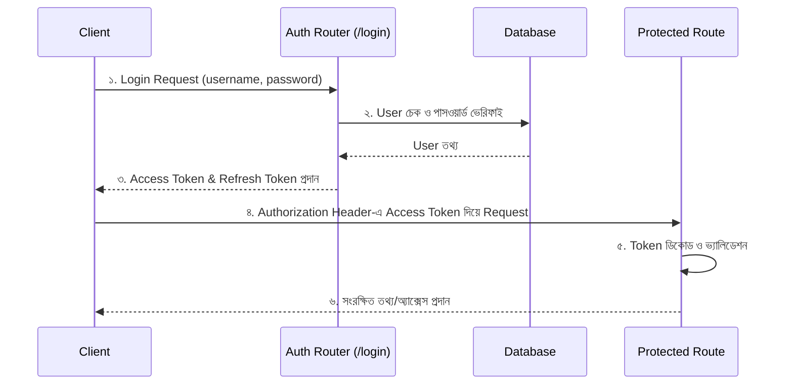

# FastAPI JWT Authentication: অথেনটিকেশন ও নিরাপত্তা (Authentication & Security)

FastAPI অ্যাপ্লিকেশনে সিকিউরিটি এবং অথেনটিকেশন যুক্ত করার জন্য আমরা **JWT (JSON Web Token)** ব্যবহার করেছি। এটি ক্লায়েন্ট ও সার্ভারের মধ্যে নিরাপদ তথ্য আদান-প্রদান করতে সাহায্য করে এবং নির্দিষ্ট কিছু এন্ডপয়েন্টকে পাসওয়ার্ড বা টোকেন ছাড়া অ্যাক্সেস করা থেকে বিরত রাখে।

এই গাইডে আমরা আলোচনা করব কীভাবে আমাদের স্পোর্টস ব্লগ অ্যাপ্লিকেশনে অথেনটিকেশন সিস্টেম ডিজাইন করা হয়েছে, সংশ্লিষ্ট ফাইলগুলোর ভূমিকা এবং কীভাবে আমরা একটি রাউট বা এন্ডপয়েন্ট প্রটেক্ট করতে পারি।

---

## ১. অথেনটিকেশন ফ্লো (Authentication Flow)

আমাদের অ্যাপে অথেনটিকেশন মূলত নিচের ধাপগুলোতে কাজ করে:



১. **লগইন ও টোকেন জেনারেট:** ইউজার `/api/auth/login` এন্ডপয়েন্টে ইউজারনেম এবং পাসওয়ার্ড দিয়ে লগইন রিকোয়েস্ট পাঠায়। পাসওয়ার্ড সঠিক হলে সার্ভার দুটি টোকেন জেনারেট করে ক্লায়েন্টকে দেয়:
   - **Access Token:** এটি কম সময়ের জন্য ভ্যালিড থাকে (যেমন: ৩০ মিনিট)। সুরক্ষিত এন্ডপয়েন্টে রিকোয়েস্ট করার জন্য এটি ব্যবহার করা হয়।
   - **Refresh Token:** এটি বেশি সময়ের জন্য ভ্যালিড থাকে (যেমন: ৭ দিন)। অ্যাক্সেস টোকেনের মেয়াদ শেষ হয়ে গেলে নতুন অ্যাক্সেস টোকেন নেওয়ার জন্য এটি ব্যবহার করা হয়।
২. **রিকোয়েস্ট ভেরিফিকেশন:** ক্লায়েন্ট পরবর্তীতে প্রতিবার সুরক্ষিত এন্ডপয়েন্টে রিকোয়েস্ট করার সময় HTTP হেডার হিসেবে `Authorization: Bearer <access_token>` পাঠায়।
৩. **ডিপেন্ডেন্সি চেক (`get_current_user`):** FastAPI টোকেনটি ডিকোড করে যাচাই করে যে ইউজারটি ভ্যালিড কিনা। ভ্যালিড হলে রিকোয়েস্ট প্রসেস হয়, অন্যথায় `401 Unauthorized` রেসপন্স রিটার্ন করে।

---

## ২. কনফিগারেশন ফাইল (`app/config.py`)

অথেনটিকেশনের জন্য প্রয়োজনীয় কী এবং সময়সীমা নির্ধারণ করা হয়েছে [config.py](file:///c:/office-work/khela-dekho-blog/sports_blog/backend/app/config.py) ফাইলে।

```python
class Settings(BaseSettings):
    SECRET_KEY: str = "CHANGE_ME"                   # JWT সাইন করার সিক্রেট কী
    ALGORITHM: str = "HS256"                         # টোকেন এনক্রিপশন অ্যালগরিদম
    ACCESS_TOKEN_EXPIRE_MINUTES: int = 30           # অ্যাক্সেস টোকেন মেয়াদ (৩০ মিনিট)
    REFRESH_TOKEN_EXPIRE_DAYS: int = 7              # রিফ্রেশ টোকেন মেয়াদ (৭ দিন)

    class Config:
        env_file = ".env"
```
> [!IMPORTANT]
> প্রোডাকশন এনভায়রনমেন্টে `SECRET_KEY` অবশ্যই একটি র্যান্ডম এবং সুরক্ষিত স্ট্রিং দিয়ে পরিবর্তন করতে হবে এবং এটি সরাসরি কোডে না রেখে `.env` ফাইলে রাখা উচিত।

---

## ৩. সিকিউরিটি মডিউল (`app/security.py`)

[security.py](file:///c:/office-work/khela-dekho-blog/sports_blog/backend/app/security.py) ফাইলে পাসওয়ার্ড হ্যাশিং এবং টোকেন জেনারেশন সংক্রান্ত মূল লজিকগুলো ডিফাইন করা হয়েছে:

### ক. পাসওয়ার্ড হ্যাশিং (Password Hashing)
পাসওয়ার্ড ডেটাবেজে প্লেইন টেক্সট হিসেবে সংরক্ষণ করা অত্যন্ত ঝুঁকিপূর্ণ। এর জন্য আমরা `pwdlib` লাইব্রেরি ব্যবহার করেছি:
* **`hash_password(plain_password: str)`**: পাসওয়ার্ড ডেটাবেজে সেভ করার আগে সেটিকে হ্যাশ করার জন্য ব্যবহার করা হয়।
* **`verify_password(plain_password: str, hashed_password: str)`**: লগইনের সময় ইউজারের ইনপুট করা পাসওয়ার্ডটি ডেটাবেজে সংরক্ষিত হ্যাশড পাসওয়ার্ডের সাথে মিলে কিনা তা যাচাই করে।

```python
from pwdlib import PasswordHash
password_hash = PasswordHash.recommended()

def hash_password(plain_password: str) -> str:
    return password_hash.hash(plain_password)

def verify_password(plain_password: str, hashed_password: str) -> bool:
    return password_hash.verify(plain_password, hashed_password)
```

### খ. টোকেন তৈরি ও ডিকোড করা
* **`_create_token`**: একটি জেনেরিক ফাংশন যা `subject` (ইউজার আইডি), `type` (access/refresh) এবং মেয়াদ নির্ধারণ করে JWT টোকেন জেনারেট করে।
* **`create_access_token`** এবং **`create_refresh_token`** ফাংশন দুটি যথাক্রমে অ্যাক্সেস এবং রিফ্রেশ টোকেন তৈরি করার জন্য ব্যবহৃত হয়।
* **`decode_token(token: str)`**: প্রাপ্ত টোকেনটি ডিকোড করে এবং সঠিক সিক্রেট কী ও অ্যালগরিদম দ্বারা স্বাক্ষরিত কিনা তা যাচাই করে। টোকেনটি ইনভ্যালিড হলে `InvalidTokenError` থ্রো করে।

### গ. কারেন্ট ইউজার ডিপেন্ডেন্সি (`get_current_user`)
এটি একটি অত্যন্ত গুরুত্বপূর্ণ ফাংশন যা প্রোটেক্টেড এন্ডপয়েন্টগুলোতে ইউজারকে অথেনটিকেট করতে ব্যবহৃত হয়।

```python
async def get_current_user(
    token: Annotated[str, Depends(oauth2_scheme)],
    db: Annotated[AsyncSession, Depends(get_db)]
) -> models.User:
    ...
```
* এটি FastAPI-এর `OAuth2PasswordBearer` ব্যবহার করে হেডার থেকে টোকেন সংগ্রহ করে।
* টোকেনটি ডিকোড করে চেক করে যে এটি একটি `access` টোকেন কিনা।
* টোকেন থেকে ইউজার আইডি (`sub`) বের করে ডেটাবেজে সেই ইউজারের অস্তিত্ব চেক করে। ইউজার পাওয়া গেলে অবজেক্টটি রিটার্ন করে, অন্যথায় `401 Unauthorized` এক্সেপশন দেয়।

---

## ৪. অথেনটিকেশন রাউটার (`app/routers/auth.py`)

[auth.py](file:///c:/office-work/khela-dekho-blog/sports_blog/backend/app/routers/auth.py) ফাইলে লগইন এবং টোকেন রিফ্রেশ করার জন্য এন্ডপয়েন্ট তৈরি করা হয়েছে।

### ক. লগইন এন্ডপয়েন্ট (`/api/auth/login`)
* এই এন্ডপয়েন্টে ইউজার ফর্ম ডেটা (`OAuth2PasswordRequestForm`) আকারে ইউজারনেম এবং পাসওয়ার্ড পাঠায়।
* ডেটাবেজ থেকে সেই ইউজারকে খুঁজে বের করে তার পাসওয়ার্ড হ্যাশ যাচাই করা হয়।
* সঠিক হলে `TokenPair` (access এবং refresh টোকেন) রেসপন্স হিসেবে পাঠানো হয়।

```python
@router.post("/login", response_model=TokenPair)
async def login(
    form: Annotated[OAuth2PasswordRequestForm, Depends()],
    db: Annotated[AsyncSession, Depends(get_db)]
):
    result = await db.execute(select(models.User).where(models.User.username == form.username))
    user = result.scalars().first()
    
    if not user or not verify_password(form.password, user.hashed_password):
        raise HTTPException(
            status_code=status.HTTP_401_UNAUTHORIZED,
            detail="Incorrect username or password",
            headers={"WWW-Authenticate": "Bearer"},
        )
    return TokenPair(
        access_token=create_access_token(user.id),
        refresh_token=create_refresh_token(user.id),
    )
```

### খ. রিফ্রেশ এন্ডপয়েন্ট (`/api/auth/refresh`)
* অ্যাক্সেস টোকেনের মেয়াদ শেষ হয়ে গেলে ক্লায়েন্ট তার রিফ্রেশ টোকেন পাঠিয়ে নতুন টোকেন পেয়ার নিতে পারে।
* এই এন্ডপয়েন্ট রিফ্রেশ টোকেন ডিকোড করে, তার `type` চেক করে এবং নতুন করে দুটি টোকেনই জেনারেট করে রিটার্ন করে।

---

## ৫. মূল অ্যাপ্লিকেশনে ইন্টিগ্রেশন (`app/main.py`)

তৈরি করা অথেনটিকেশন রাউটারটি [main.py](file:///c:/office-work/khela-dekho-blog/sports_blog/backend/app/main.py) ফাইলে এভাবে রেজিস্টার করা হয়েছে:

```python
from app.routers import posts, users, auth

# ... অন্যান্য কোড ...

app.include_router(auth.router)
```

---

## ৬. প্রাকটিক্যাল উদাহরণ: সুরক্ষিত এন্ডপয়েন্ট তৈরি (How to Protect Routes)

কোনো এন্ডপয়েন্টকে সুরক্ষিত করতে বা শুধুমাত্র লগইন করা ইউজারকে অ্যাক্সেস দিতে চাইলে আমাদের তৈরি করা `get_current_user` ডিপেন্ডেন্সিটি ব্যবহার করতে হবে।

### উদাহরণ: নতুন পোস্ট তৈরি করার সময় অথেনটিকেশন

পূর্বে আমাদের `posts.py` ফাইলে পোস্ট তৈরি করার জন্য রিকোয়েস্ট বডিতে `user_id` পাস করতে হতো, যা মোটেও নিরাপদ নয়। অথেনটিকেশন ব্যবহার করে আমরা এটি যেভাবে পরিবর্তন করতে পারি:

**নিরাপদ পদ্ধতি (পছন্দনীয়):**
```python
from app.security import get_current_user

@router.post("", response_model=PostResponse, status_code=status.HTTP_201_CREATED)
async def create_post(
    post: PostCreate, 
    current_user: Annotated[models.User, Depends(get_current_user)], # ডিপেন্ডেন্সি যুক্ত করা হল
    db: Annotated[AsyncSession, Depends(get_db)]
):
    # এখন আমরা রিকোয়েস্ট বডি থেকে নয়, বরং টোকেন থেকে প্রাপ্ত ইউজার আইডি ব্যবহার করব
    new_post = models.Post(
        title=post.title,
        content=post.content,
        user_id=current_user.id  # টোকেন থেকে প্রাপ্ত সুরক্ষিত ইউজার আইডি
    )
    db.add(new_post)
    await db.commit()
    await db.refresh(new_post)
    ...
```

এইভাবে `Depends(get_current_user)` ব্যবহার করলে ক্লায়েন্ট যদি ভ্যালিড অ্যাক্সেস টোকেন হেডার এ না পাঠায়, তাহলে FastAPI স্বয়ংক্রিয়ভাবে `401 Unauthorized` রেসপন্স পাঠাবে এবং ফাংশনটি এক্সিকিউট হবে না।

---

## সংক্ষেপে প্রয়োজনীয় কমান্ড ও প্যাকেজ

১. **PyJWT**: টোকেন জেনারেট এবং ভ্যালিডেশনের জন্য:
   ```bash
   pip install pyjwt
   ```
২. **pwdlib**: পাসওয়ার্ড হ্যাশ ও ভেরিফাই এর জন্য:
   ```bash
   pip install pwdlib[argon2]
   ```
